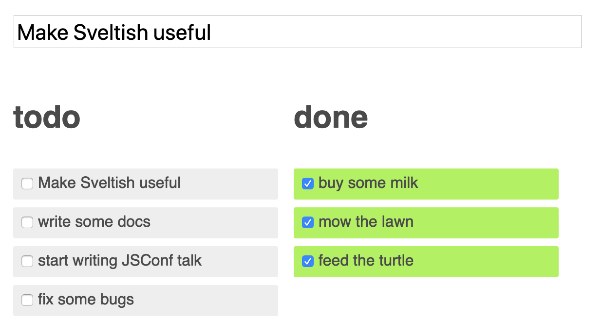

# Sveltish

An experiment in applying the design principles from [Svelte](svelte.dev) to native Fable. Svelte is impressive in its own right, but I can't help thinking that Fable is a compiler that's already in our toolchain, and is able to do what Svelte does with respect to generating boilerplate.

It's all very much a work-in-progress, and I'm exploring what's possible, so the code is a sprawling mess. If this
is worth pursuing, then it will need refactoring and organizing.

Some aspects that are working or in progress

## DOM builder
Crude and minimal. It's Feliz-styled, but builds direct into DOM. If this project proceeds it would be good to layer on top of Feliz.

```fsharp
    div [
        className "container"
        p [ str "Fable is running" ]
    ]
```

## Stores

Similar to Svelte stores, using the same API

```fsharp
    let count = Sveltish.makeStore 0
    button [
      className "button"
      onClick (fun _ -> count.Value() + 1 |> count.Set)
      count.Value() |> sprintf "You clicked: %i time(s)" |> str
    ]
```

## Bindings

The intention is to have Fable or a Fable plugin analyze the AST and produce bindings automatically. F# even in my inexperienced hands does an amazing job of reducing boilerplate to a minimum, but it's still boiler plate.

The button example above won't yet update on button clicks. Here's how we make that happen:

```fsharp
    let count = Sveltish.makeStore 0
    button [
      className "button"
      onClick (fun _ -> count.Value() + 1 |> count.Set)
      count.Value() |> sprintf "You clicked: %i time(s)" |> str
    ]

    (fun () -> count.Value() |> sprintf "You clicked: %i time(s)" |> str)
       |> bind count
```

It's ugly, but with Fable's help that can be made to look this:

```fsharp
    let count = Sveltish.makeStore 0
    button [
      className "button"
      onClick (fun _ -> count + 1 |> count.Set)
      count |> sprintf "You clicked: %i time(s)" |> str
    ]
```

## Styling

Working like Svelte. Here's how the Svelte `animation` example is coming along with respect to the styling.



```fsharp
let styleSheet = [
    rule ".new-todo" [
        fontSize "1.4em"
        width "100%"
        margin "2em 0 1em 0"
    ]

    rule ".board" [
        maxWidth "36em"
        margin "0 auto"
    ]

    rule ".left, .right" [
        ``float`` "left"
        width "50%"
        padding "0 1em 0 0"
        boxSizing "border-box"
    ]

    // ...
]

let view =
    style styleSheet <| div [
        className "board"
        input [
            className "new-todo"
            placeholder "what needs to be done?"
        ]

        todosList "left" "todo" (fun t -> not t.Done) |> bind todos
        todosList "right" "done" (fun t -> t.Done) |> bind todos
    ]
```

## Transitions

Working on these right now. The key is being notified of a change in an element's visibility. The DOM intends to listen to a visibility expression (a `Store<bool>`) and then update style `display: none|<not-none>;`. Like a call to `$.show()` in you-know-what.

Here is today's progress:


Here's the code for this component:

```fsharp

let Counter attrs =
    let count = Sveltish.makeStore 0
    div [
        button [
            className "button"
            onClick (fun _ ->
                console.log("click")
                count.Value() + 1 |> count.Set)

            (fun () ->
                str <| if count.Value() = 0 then "Click Me" else count.Value() |> sprintf "You clicked: %i time(s)"
            ) |> bind count
        ]

        button [
            className "button"
            Attribute ("style", "margin-left: 12px;" )
            onClick (fun _ -> 0 |> count.Set)
            str "Reset"
        ]

        (div [ str "Click button to start counting" ])
        |> transition
                (InOut (Transition.slide, Transition.fade))
                (count |~> exprStore (fun () -> count.Value() = 0))  // Visible if 'count = 0'

    ]
```
The `transition` wrapper manages visibility of the contained element, according to the expression. It then uses
the specified transitions to handle entry and exit of the element from the DOM.

Next is to make the transitions work for the control construct used to render the todos list

