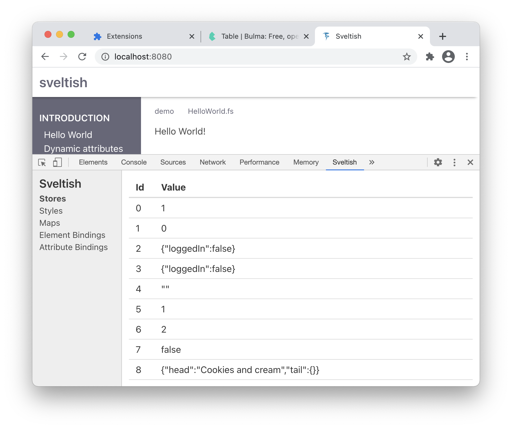
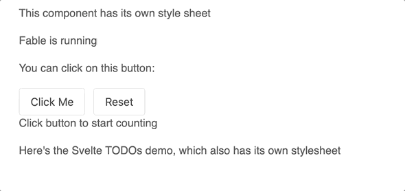

# Sveltish

An experiment in applying the design principles from [Svelte](https://svelte.dev/) to native Fable. At first I thought that we might make use of a Fable compiler plugin to generate boilerplate, but it turns out that F# does a pretty good job of that itself.

See the [Sveltish website](https://davedawkins.github.io/Fable.Sveltish/) for demos.

Here's how the Sveltish Todos app looks. This is an augmented port of the [Svelte animate example](https://svelte.dev/examples#animate)


Implementing this app is pushing the library. As each new demo example is added, it might require tweaking to existing capabilities, a bug fix, a new feature to be added (or ported over from Svelte), or even a rework of some of the internals. It's a good driver for the library in its own right.

## Changelog (most recent first)

- Improved return value from NodeFactory. Experimented with IFactory, moved to branch.
- Rework on binding and each block. Better tracking of created elements and reference fixing when bound elements changed etc
- More "each" block examples. Covered a few more cases than are given in Svelte, due to differences in F# and JS. Still a w.i.p.
- Browser DevTools plugin. Only *just* got the stores view working. See section `DevTools` further down.


- More examples: FileInputs, Dimensions, If/Else/If-Else. Ported resize observer from Svelte (very clever stuff)
- Textarea example. Introduces `html` element to inject raw HTML, using an imported JS markdown library.
- Fix for issue #5
- Convert main app to Elmish. See src/App/App.fs
- Alfonso's PR also gives us a better Elmish MVU architecture than I had previously. See section further down on MVU
- Switch to Observable-based stores, thanks to PR from Alfonso
- Select bindings example
- Select multiple example. Apply styling (Bulma) to other examples
- Finished GroupInputs example. Bindings for radio groups and checkbox groups
- Started on GroupInputs example. Introduces bindGroup. Added Store.map2
- Added NumericInputs examples
- Styling rules can extend existing classes like this
```
    // Turn <label> into <label class='label'>. Useful if you have Bulma loaded, for example
    rule label {
        addClass "label"
        // other styles
    }

let view() = input [ ... ]  // No need to add class 'label' to make it into a Bulma input
```
- Cleaner support for Store<List<'T>>. See updated Todos example
- Added CheckboxInputs example. Tweaks to attribute binding
- Added ReactiveStatements example
- Refactored Stores (we now have Store.map and readable function equivalents for all operators)
- Fixes to demo app styling and production bundling thanks to a PR from [s0kil](https://github.com/s0kil)
- Demo app support for syntax highlighting example code. See section **Interacting with 3rd-party libraries**
- More examples ported into demo app

# Getting Started

The following will help you get started with the Sveltish features. (work in progress)

An additional reference manual is required provide full details of each feature. (not started)

## DOM builder

The simplest Sveltish app:

```f#
    open Sveltish.DOM

    mountElement "sveltish-app" (text "Hello World")
```

where your `index.html` contains
```html
    <div id="sveltish-app"/>
```

Introducing `div`, `p` and a view function:

```f#
    open Sveltish.Html
    open Sveltish.DOM

    let view = div [
        p [ text "Hello World" ]
    ]

    mountElement "sveltish-app" view
```

Use a prefix for elements if you prefer:

```f#
    open Sveltish
    open Sveltish.DOM

    let view = Html.div [
        Html.p [ text "Hello World" ]
    ]

    mountElement "sveltish-app" view
```

Setting attributes. Note the trailing `'` for attributes that are F# keywords or core functions (such as `id` and `type`)

```f#
    open Sveltish
    open Sveltish.DOM
    open Sveltish.Attr

    let view = Html.div [
        class' "container"
        style  "background: #eeeeee;"
        Html.input [
            placeholder "Enter your name"
            type' "text"
        ]
    ]

    mountElement "sveltish-app" view
```

Handling events:

```f#
    open Sveltish
    open Sveltish.DOM
    open Sveltish.Attr
    open Browser.Types

    let view = Html.div [
        text "Click on me"
        onClick (fun e -> console.log("Clicked"))
    ]

    mountElement "sveltish-app" view
```

## Styling

You can apply specific styling to your components:

```f#
    open Sveltish
    open Sveltish.DOM
    open Sveltish.Attr

    let exampleCss = [
        rule "p" [
            color "red"
            fontSize "120%"
        ]
    ]

    let view = Html.div [
        Html.p [ "This is styled locally" ]
    ] |> withStyle exampleCss

    mountElement "sveltish-app" view
```

Alternative F# syntax:
```f#
    let view = withStyle exampleCss <| Html.div [
        Html.p [ text "This is styled locally" ]
    ]
```

In the following example, the subcomponent overrides the parent style and so isn't affected.

```f#
    let view = withStyle exampleCss <| Html.div [
        Html.p [ text "This is styled locally" ]

        Html.div [
            Html.p [
                text "A subcomponent"
            ]
        ] <| withStyle []
    ]
```

## Style Frameworks

Frameworks such as Bulma and Bootstrap are still an option.
Include the framework style in the index.html `<head>` as usual and use the `class'` attribute etc.

```f#
    let view = Html.div [
        class' "container"  // Bulma / Bootstrap etc
        Html.button [
            class' "button"
            text "Not In Service"
        ]
    ]
```

Note that you can still use `withStyle`, which will override framework styling.

```f#
    let localCss = [
        rule ".button" [
            fontSize: "120%"
        ]
    ]

    let view = Html.div [
        class' "container"  // Bulma / Bootstrap etc
        Html.button [
            class' "button"
            text "Bigger Button"
        ]
    ] <| withStyle localCss
```

Sveltish introduces `addClass` as an experimental pseudo-style, which can provide a kind of style inheritance.

```f#
    let localCss = [
        rule "button" [
            addClass "button" // Turn <button> into <button class="button">
        ]
        rule ".button" [
            fontSize: "120%"
        ]
    ]
    let view = Html.div [
        class' "container"  // Bulma / Bootstrap etc
        Html.button [  // Doesn't need class specifier now
            text "Bigger Button"
        ]
    ] <| withStyle localCss
```

## Stores

Similar to Svelte stores, using the same API

```f#
    let count = Sveltish.makeStore 0
    button [
      class' "button"
      onClick (fun _ -> Store.modify (fun n -> n + 1))
      text "Click Me"
    ]
```

## Bindings

We can react to count being updated:

```f#
    let count = Sveltish.makeStore 0
    button [
      class' "button"
      onClick (fun _ -> Store.modify (fun n -> n + 1))
      (fun n -> $"You clicked: {n} time(s)" |> text)
          |> bind count
    ]
```

## Transitions

Transitions can be specified with the `transition` binding function. This is an extended form of the `show` binding which
just shows or hides an element according to a given `Store<bool>`.



Here's the code for this component:

```f#
let Counter attrs =
    let count = Store.make 0
    div [
        button [
            class' "button"
            onClick (fun _ -> Store.modify count (fun n -> n + 1))

            // Boiler plate to be generated by Fable plugin
            (fun n ->
                text <| if n = 0 then "Click Me" else $"You clicked: {n} time(s)"
            ) |> bind count
        ]

        button [
            class' "button"
            style "margin-left: 12px;"
            onClick (fun _ -> Store.set count 0)
            text "Reset"
        ]

        // More boilerplate that can be generated automatically
        (div [ text "Click button to start counting" ])
        |> transition
                (InOut (Transition.slide, Transition.fade))
                (count |> Store.map (fun n -> n=0))  // Visible if 'count = 0'

    ]
```
The `transition` wrapper manages visibility of the contained element, according to the expression. It then uses
the specified transitions to handle entry and exit of the element from the DOM.

We now have `fade`, `fly` and `slide` transitions


```f#
(Html.div [ className "hint"; text "Click button to start counting" ])
|> Bindings.transition
        (Both (Transition.fly,[ X 100.0; Y 100.0; ]))
        (count |> Store.map (fun n -> n=0))  // Visible if 'count = 0'
```

The `each` control manages keyed lists. Items that appear in, disappear from and move around in the list
can be transitioned:


```f#
let todosList title filter tin tout model dispatch =
    Html.div [
        class' title
        Html.h2 [ text title ]

        each model.Todos key filter (InOut (tin,tout) ) (fun todo ->
            Html.label [
                Html.input [
                    type' "checkbox"
                    attrNotify "checked" todo.Done (fun _ -> todo.Id |> ToggleTodo |> dispatch)
                ]
                text $" {todo.Description}"
                Html.button [
                    on "click" (fun _ -> todo.Id |> DeleteTodo |> dispatch)
                    text "x"
                ]
            ]
        )
    ]
```

## Model-View-Update (Elmish) support

A Sveltish program can support Elmish MVU as in the following example.

Notice that the view function is called only once, and mutates the DOM according to model bindings

```f#
type Model = { Count : int }
type Message = Increment | Decrement

let init() = { Count = 0 }

let update msg model =
    match msg with
    | Increment -> { model with Count = model.Count + 1}
    | Decrement -> { model with Count = model.Count - 1}

let view() =
    let model, dispatch = makeElmishSimple init update ignore

    Html.div [
        bind model <| fun m -> text $"Count is {m.Count}"
        Html.button [
            onClick (fun _ -> dispatch Decrement)
            text "-"
        ]
        Html.button [
            onClick (fun _ -> dispatch Increment)
            text "+"
        ]
    ]

view() |> Sveltish.DOM.mountElement "sveltish-app"
```

## Interaction with 3rd-party libraries

The app now has syntax highlighting, in the form of highlight.js (a dependency of the app, and not the library). This required a few enhancements:
- custom events from Sveltish that can be used to tell highlight.js to reformat
- resilience to DOM nodes disappearing that were being watched by Sveltish (this will be an ongoing challenge).
- relaxation of the idea that all edits to index.html happen programmatically - you can add stylesheet and script tags to the head programmatically
but things like highlight.js needed a short JS fragment. (However, writing this just now, I think I see how I can actually just write that in Fable
with a minor interop edit. Fable is fantastic with JS interop.)

The problem I had was because I was Sveltish-binding to a `text` node, which would be replaced by highlight.js. Sveltish handles this, but can't be
100% sure on the recovery strategy. It's a good test case so I've left it this way in the way, but a quicker fix by far would have been to bind to the
outer `<code>` or `<pre>` elements.

## DevTools

### Current Status
This is a working proof-of-concept. To activate, you'll need to clone/download the repo and then:

In Chrome:
- `Settings -> More tools.. -> Extensions`
- Click `Load unpacked`
- Select the repo's `devtools` folder

In Firefox (later though):
- Go to page "about:debugging"
- Click `This Firefox`
- Click `Load Temporary Add-on`

In Chrome you can right-click in the extensions itself to `Inspect element`. In Firefox, you can do the same from the `This Firefox` page.

I ended up preferring Chrome to get the basics working, it was a much easier workflow in the early stages

### Possibilities

- Write the extension in Sveltish. It's currently in JS to get it out of the ground, but it already calls back into Fable code
- Sveltish-focused DOM tree
- Show mapping expressions (understand the dependency expression graph)
- Show subscribers (help to understand if cleanup is working, etc)
- Live update
- ...more
