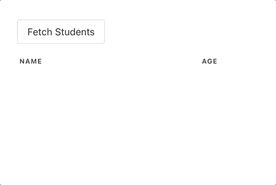

A full example with a test server can be found at [sutil-template-remoting](https://github.com/davedawkins/sutil-template-remoting).



The server is taken directly from the README for [Fable.Remoting](https://github.com/Zaid-Ajaj/Fable.Remoting), and implements a simple API for fetching student records.

## Client

The client is a Sutil Elmish app that fetches the records.


See [App.fs](https://github.com/davedawkins/sutil-template-remoting/blob/main/Client/src/App.fs) for the full client source.


Note how `Cmd.OfAsync` is used to thread the server calls into the Elmish processing loop.

```fs
//norepl
type Message =
    | FetchStudents
    | SetStudents of Student list

let init() = { Students = [] }, Cmd.none

let update appctx msg model =
    match msg with

    | FetchStudents ->
        model,
        Cmd.OfAsync.perform (appctx.Api.allStudents) () SetStudents

    | SetStudents students ->
        { model with Students = students },
        Cmd.none

```

Initialization is the same as described in the Fable.Remoting example.

In this application, the server API instance is wrapped in an `AppContext` record and partially applied to the Elmish `update` function. It could easily have been a global variable in this case, but this approach allows the server to be passed to other modules in your application that can't see local declarations.

```fs
//norepl

type AppContext = {
    Api : IStudentApi
}

let update (appctx: AppContext) msg model = ...

let main() =

    let makeStudentApi() =
        Remoting.createApi()
        |> Remoting.buildProxy<IStudentApi>

    let app = {
        Api = makeStudentApi()
    }

    let model, dispatch = () |> Store.makeElmish init (update app) ignore

    view  model dispatch |> Program.mountElement "sutil-app"

main()
```
